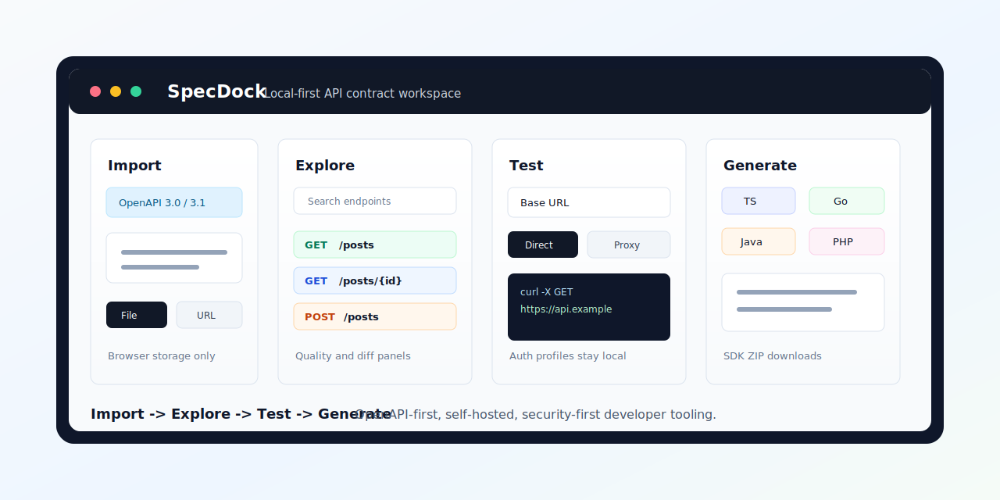

# SpecDock

[](https://github.com/dev-ik/specdock/actions/workflows/ci.yml)
[](https://github.com/dev-ik/specdock/releases)
[](https://hub.docker.com/r/d8vik/specdock)
[](LICENSE)

Local-first OpenAPI workspace to import specs, test requests, and generate SDKs.

SpecDock keeps the everyday API contract loop in one browser workspace:

```txt
Import -> Explore -> Test -> Generate
```

Try the hosted demo: [https://specdock.ru](https://specdock.ru)



## What It Does

- Import OpenAPI 3.0/3.1 specs from raw text, file upload, or URL.
- Explore endpoints grouped by tags with search and operation details.
- Build requests with path/query/header params, JSON body, cURL preview, and saved Base URL/Mode.
- Store per-project auth profiles locally in the browser for repeat testing.
- Execute requests in Direct Browser Mode or restricted self-hosted Proxy Mode.
- Inspect saved request/response exchanges per endpoint or latest request.
- Generate TypeScript, Python, Go, Java, C#, and PHP SDK files with ZIP downloads.
- Store projects, settings, safe request preferences, and history metadata in local browser storage.

The hosted demo is for evaluation. It does not provide unrestricted proxying for arbitrary third-party APIs. For controlled proxy execution, run SpecDock yourself and configure an explicit host allowlist.

## Quick Start

Prerequisites:

```txt
Node.js >=20.19.0 <21 or >=22.13.0
npm
```

Install and run:

```bash
nvm use
npm install
npm run dev
```

Open:

```txt
http://127.0.0.1:5174
```

Demo OpenAPI spec:

```txt
http://127.0.0.1:5174/examples/specdock-demo-openapi.yaml
```

## Docker

Run from source:

```bash
docker compose up -d --build
```

Run the
[published Docker Hub image](https://hub.docker.com/r/d8vik/specdock)
without cloning the repository:

```bash
docker run -d --name specdock \
  -p 127.0.0.1:3000:3000 \
  -e PUBLIC_DEMO=true \
  -e PROXY_ENABLED=false \
  docker.io/d8vik/specdock:v0.2.3
```

Or keep configuration in a local env file:

```env
PUBLIC_DEMO=false
PROXY_ENABLED=true
PROXY_ALLOWED_HOSTS=api.example.com,staging-api.example.com
PROXY_ALLOW_PRIVATE_TARGETS=false
```

```bash
docker run -d --name specdock \
  -p 127.0.0.1:3000:3000 \
  --env-file ./specdock.env \
  docker.io/d8vik/specdock:v0.2.3
```

If you prefer Compose with the published image, create your own
`docker-compose.yml`:

```yaml
services:
  specdock:
    image: docker.io/d8vik/specdock:v0.2.3
    ports:
      - "127.0.0.1:3000:3000"
    environment:
      PUBLIC_DEMO: "true"
      PROXY_ENABLED: "false"
```

Open:

```txt
http://127.0.0.1:3000
```

Check health:

```bash
curl -fsS http://127.0.0.1:3000/api/health
```

Use immutable version tags such as `docker.io/d8vik/specdock:v0.2.3`.
The project does not rely on `latest` for releases.

## Configuration

Public/demo deployments should keep backend proxy mode disabled:

```env
PUBLIC_DEMO=true
DEMO_DIRECT_ALLOWED_HOSTS=dummyjson.com,petstore3.swagger.io,httpbin.org
PROXY_ENABLED=false
```

When `PUBLIC_DEMO=true`, Direct Browser Mode is limited to
`DEMO_DIRECT_ALLOWED_HOSTS`. Run SpecDock locally or self-host it to test
custom API hosts from the request builder.

Trusted self-hosted deployments can enable restricted proxy mode:

```env
PUBLIC_DEMO=false
PROXY_ENABLED=true
PROXY_ALLOWED_HOSTS=api.example.com,staging-api.example.com
PROXY_ALLOW_PRIVATE_TARGETS=false
```

Do not enable unrestricted public proxying. Proxy requests are protected by explicit host allowlists, SSRF checks, header filtering, timeout limits, and request/response size limits. Self-hosted deployments should also use outbound firewall rules for internal networks.

When running behind a trusted loopback reverse proxy, set `TRUST_PROXY=loopback`.
Leave it disabled for direct public exposure.

## Development Checks

```bash
nvm use
npm run typecheck
npm run lint
npm run test
npm run test:sdk-smoke
npm run build
```

## SDK Generation

SpecDock currently generates TypeScript SDKs with fetch or axios clients,
Python SDKs with httpx clients, Go SDKs with the standard library, and Java
SDKs with `java.net.http.HttpClient`, and C# SDKs with `HttpClient` plus
`System.Text.Json`. It also generates PHP SDKs with Guzzle clients.
Generated SDK metadata includes the target runtime version for each language:
TypeScript 5.x on Node.js 20+ or modern browsers, Python >=3.11, Go 1.22,
Java 17, .NET 8.0, and PHP >=8.1.

| Language | Runtime target | HTTP runtime |
| --- | --- | --- |
| TypeScript | TypeScript 5.x, Node.js 20+ or modern browsers | fetch or axios |
| Python | Python >=3.11 | httpx >=0.27.0 |
| Go | Go 1.22 | net/http |
| Java | Java 17 | java.net.http + Jackson 2.17.2 |
| C# | .NET 8.0 | HttpClient + System.Text.Json |
| PHP | PHP >=8.1 | Guzzle ^7.0 |

Each generated SDK includes a `README.md` and `specdock.manifest.json` with
the selected language, runtime target, naming style, generator version, and
generated file list. The smoke test generates every supported language and
runs syntax/build checks when the matching runtime is available locally.

The generator roadmap keeps language-specific rendering behind shared
OpenAPI-to-SDK planning, so generated clients remain predictable while each
language can use its native HTTP and typing conventions.

## Repository Layout

```txt
apps/api        Fastify API, proxy endpoint, generation endpoint, static web serving
apps/web        React/Vite web workspace
packages/core   OpenAPI normalization, storage contracts, shared types
packages/generator SDK generation
packages/ui     Shared UI package placeholder
docs            Architecture, security, deployment, smoke tests, and roadmap
```

## Documentation

- [Master plan](docs/SPECDOCK_MASTER_PLAN.md)
- [Changelog](CHANGELOG.md)
- [Implementation plan](docs/IMPLEMENTATION_PLAN.md)
- [API contracts](docs/API_CONTRACTS.md)
- [Data models](docs/DATA_MODELS.md)
- [Storage model](docs/STORAGE_MODEL.md)
- [SDK output spec](docs/SDK_SPEC.md)
- [Multi-language SDK generation plan](docs/implementation-plan/multi-language-sdk.md)
- [Deployment](docs/DEPLOYMENT.md)
- [Security](SECURITY.md)
- [Smoke tests](docs/SMOKE_TESTS.md)
- [Release](docs/RELEASE.md)
- [Roadmap](docs/ROADMAP.md)
- [Contributing](CONTRIBUTING.md)
- [Code of conduct](CODE_OF_CONDUCT.md)

## Open-Source Hygiene

The repository intentionally ignores local-only files:

```txt
.env
.history
.playwright-mcp
docs_deprecated
docs/BOOTSTRAP_REPOSITORY.md
docs/TASKS.md
```

Do not commit local credentials, private proxy targets, provider-specific hosting entrypoints, or generated build output.

## License

SpecDock is released under the [MIT License](LICENSE).
